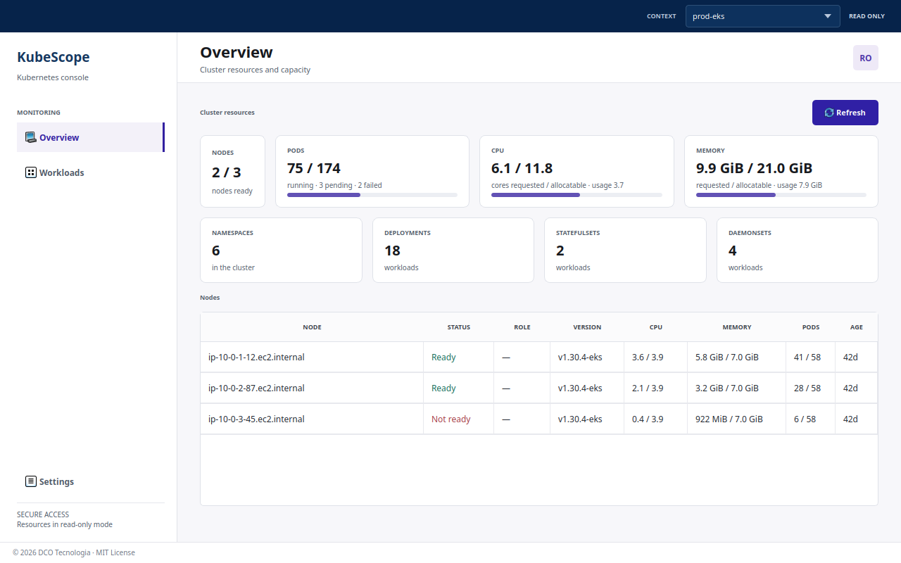

# KubeScope

[](https://github.com/dcotecnologia/kubescope/actions/workflows/ci.yml)
[](LICENSE)
[](pyproject.toml)
[](https://doc.qt.io/qtforpython-6/)
[](#packaging)
[](https://docs.astral.sh/ruff/)
[](https://kubernetes.io/)

Desktop viewer for Kubernetes workloads, including Amazon EKS clusters available
through the local Kubernetes configuration. The packaged application includes
its own `kubectl` executable. It is read-only for now: it lists and inspects
resources but does not change the cluster.



*The cluster overview, shown with sample data. Regenerate it with
`make screenshot`.*

## Features

- **Overview:** nodes, Pod counts, CPU and memory requests against capacity, and
  the number of namespaces, Deployments, StatefulSets and DaemonSets.
- **Workloads:** open the **Workloads** menu to slide out **Pods** and
  **Deployments**.
  - Both lists show CPU, memory and restarts next to the status, and can be
    filtered by namespace and searched by name.
  - CPU and memory are live usage from `metrics-server`; without it they show
    `—`. A Deployment's numbers are the sum of its Pods.
  - In the Pods list, young Pods (under an hour) get a soft green row and Pods
    that are restarting, failing or not ready get a soft red one.
- **Details and logs:** JSON details of a Pod or Deployment, and live Pod logs,
  each in its own closable tab.
- **Your table, your way:** drag any column border to resize it, and right-click
  a table header to hide or show columns. The choice is remembered.
- **Readable errors:** a missing login tool, an unreachable cluster, expired
  credentials or denied access appear as a short message with a hint; the
  original `kubectl` text stays one click away as details.
- **English and Portuguese**, selectable in Settings.

## Requirements

- Python 3.12 or newer to run from source
- Linux Mint/Ubuntu: `apt-get` and `dpkg-deb` to stage the Qt XCB runtime library
- AWS CLI and valid AWS credentials for EKS contexts whose kubeconfig uses the
  AWS `exec` credential plugin
- Read access to namespaces, pods, deployments, statefulsets, and daemonsets
- Optional, for the cluster overview page: read access to nodes and pods across
  namespaces. Optional, for CPU and memory in the Pods and Deployments lists and
  on the overview: `metrics-server` for real usage. Sections the role
  cannot read are reported on the page instead of failing it

## Run from source

```bash
make setup                      # uv sync with the dev and build extras
uv run pre-commit install       # run the checks on every commit
python tools/fetch_kubectl.py
make run
```

`make run` stages `libxcb-cursor.so.0` locally on Linux and adds it to the
runtime library path. This avoids installing `libxcb-cursor0` system-wide. On
non-Linux systems, the target starts the app without the Linux-specific library.

The app reads contexts from the default kubeconfig (`~/.kube/config` or the path
in `KUBECONFIG`). It only reads cluster resources. Configure a read-only
Kubernetes role for the contexts used by the app.

## Build a bundled application

Build on each target operating system and architecture. The fetch script obtains
the official stable `kubectl` release and verifies its published SHA-256 before
PyInstaller includes it in the application bundle.

```bash
python -m pip install -e '.[build]'
python tools/fetch_kubectl.py
python tools/fetch_linux_qt_libs.py  # Linux only
pyinstaller --noconfirm KubeScope.spec
```

The distributable application is created under `dist/KubeScope/`.

## Settings and language

The **Settings** page (sidebar) stores preferences as JSON in
`~/.config/kubescope/settings.json` (`%APPDATA%\\kubescope` on Windows,
`~/Library/Application Support/kubescope` on macOS; override with
`KUBESCOPE_CONFIG_DIR`). It lets you pick the language (automatic, English or
Portuguese), remember the last context, and give each kubeconfig context a
friendlier display name. The real context name is still used for every request.
Hidden table columns are stored in the same file.

Source strings are English; translations live in
`src/kubescope/translations/*.ts` (editable in Qt Linguist). After adding or
changing texts run `make i18n` to extract new strings and compile the `.qm` files.

## Packaging

```bash
make build      # PyInstaller bundle in dist/KubeScope
make deb        # dist/kubescope_<version>_amd64.deb (Debian/Ubuntu)
make appimage   # dist/KubeScope-<version>-x86_64.AppImage (any Linux with glibc)
make flatpak    # dist/KubeScope-<version>.flatpak (needs flatpak-builder)
make windows    # installer and portable zip; on Linux it builds inside Wine
```

Each of these packages the bundle in `dist/KubeScope`, so build one platform at a
time. `make windows` keeps its Wine prefix in `.wine/` and downloads Python and
Inno Setup on the first run.

The Flatpak (`com.dcotecnologia.KubeScope`) bundles the AWS CLI so EKS contexts
can sign in from the sandbox, and can read `~/.kube` (read-only) and `~/.aws`.
Other credential plugins, such as `gcloud` or `kubelogin`, are not available
inside it.

Windows packages can also be built without Wine: the **Release** workflow
(`.github/workflows/release.yml`) builds everything on GitHub runners: the Linux
`.deb` and AppImage on Ubuntu 22.04 (lower glibc requirement) and the Windows
installer plus a portable zip on Windows. Run it from the Actions tab, or push a
`v*` tag to also publish a GitHub release.

## Editing the UI

The screens are Qt Designer files in `src/kubescope/ui/`:

```bash
make designer   # open the .ui files in Qt Designer
make ui         # regenerate ui_*.py after saving (commit both)
make preview    # open the app with fake data, no cluster needed
```

Widget `objectName`s are used by the style sheet and by `window.py`, so keep
them when renaming or moving widgets.

## Code signing

Free code signing for the Windows installer is provided by
[SignPath.io](https://signpath.io), certificate by the
[SignPath Foundation](https://signpath.org). See the
[code signing policy](https://kubescope.dcotecnologia.com/code-signing).

## Contributing and security

Read [CODE_OF_CONDUCT.md](CODE_OF_CONDUCT.md) and [CONTRIBUTING.md](CONTRIBUTING.md) before opening a pull request, and
[COMMITING.md](COMMITING.md) for the commit message format. [AGENTS.md](AGENTS.md)
holds the architecture and standards that people and AI assistants follow.
Report vulnerabilities privately as described in [SECURITY.md](SECURITY.md).

## Author

Danilo Carolino <danilogcarolino@gmail.com>

---

Developed by **DCO Tecnologia** · Released under the [MIT License](LICENSE).
